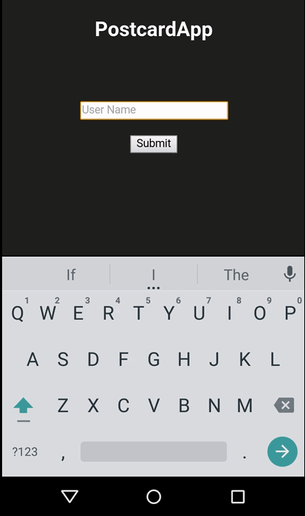

Postcard App Demo

 

This is intended as a sample project illustrating how to use the [Thali Project](http://www.thaliproject.org) APIs.

This project is based on Cordova. It does not however ship with any Cordova platforms nor with the JXCORE-CORDOVA
plugin it depends on.

Therefore after cloning this project please:

1. Follow the instructions [here](https://cordova.apache.org/docs/en/4.0.0/guide_cli_index.md.html) to install
node.js, Cordova and whatever platforms you require (e.g. cordova plafrom add android and cordova platform add ios).

2. Then run 'cordova plugin add https://github.com/jxcore/jxcore-cordova.git' from postcardapp folder to
install the JXCore-Cordova plugin.

3. Then run 'cordova platform add android' (or what ever platform you are using) to add the platform support  

4. From command line goto postcardapp/www/jxcore folder, and run 'npm install'
  - 4a. Check the node_modules folder and see if leveldown_mobile is there. If not, run 'jx install leveldown-mobile)
  - 4b. Check the node_modules folder again and see if leveldown_mobile is there. If not, goto node_modules folder, and git clone [here](https://github.com/Level/leveldown-mobile) and run 'npm install' from leveldown-mobile folder

5. Go to file explorer and goto postcardapp/www/jxcore/node_modules and search for *.gz" and delete all *.gz files

6. Now you can run 'cordova run android' from postcardapp folder (or whatever platform you are using) and it should just run.

